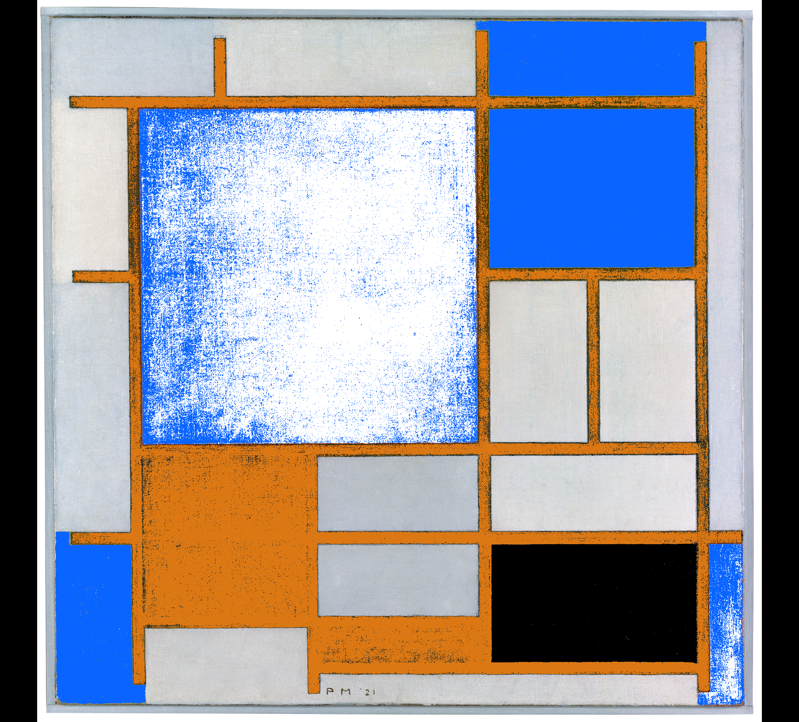
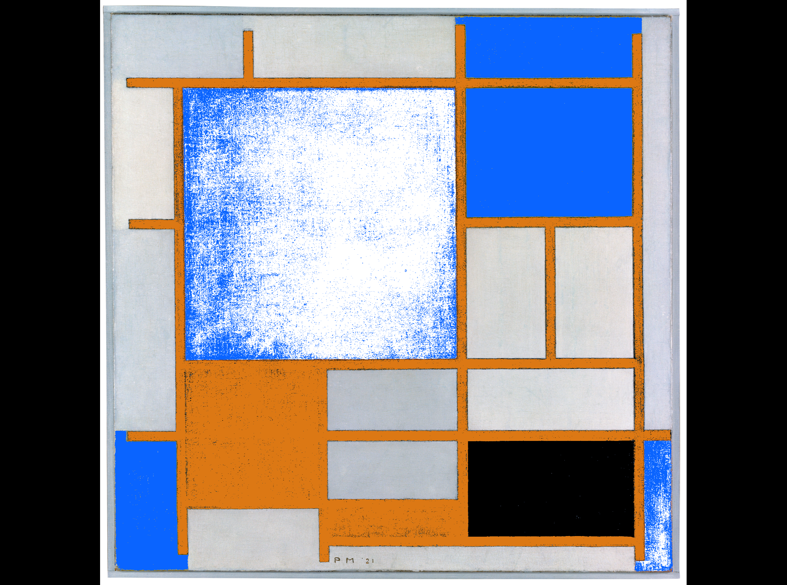
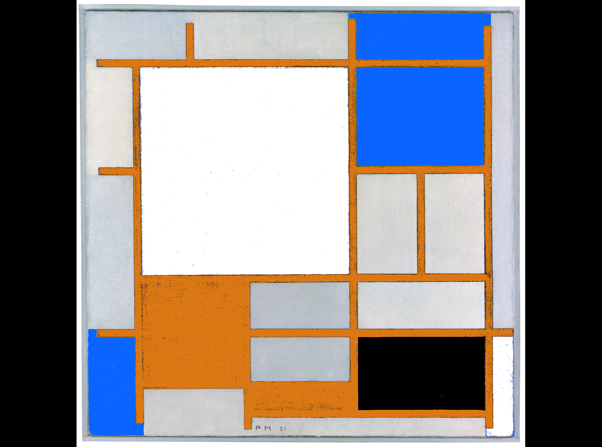
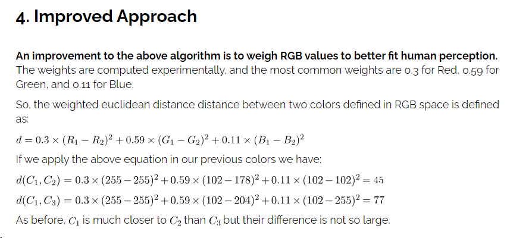
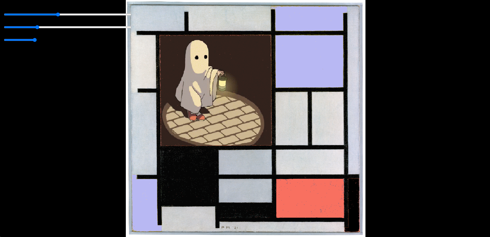
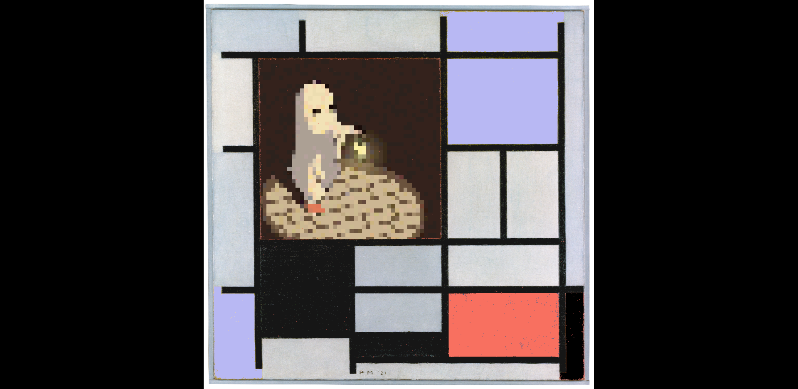

# HW08A: Neon Mondrian

In the Neon Mondrian project, I modified a Piet Mondrian painting by manipulating pixels. I changed the yellow and blue into two other different colors, replaced the largest red square with a GIF image, and adjusted the black in the image by controlling the lower slider in the upper left corner of the canvas. The slider above controls the similarity value, which controls the color detection in the image. 

## How I detect the colors
Initially, I detected the colors by comparing each pixel's color with Mondrian Red, Blue, Yellow, and Black. First, I used the Paint software in Windows to extract the four colors, and save them as four global variables. Then, for each image pixels, I compare its R, G, and B values with those of each Mondrian's color. For example, if the differences in R, G, and B values of a pixel and Mondrian Red are all below a value, then a Mondrian color is detected. Below is the effect of similarity value = 50. 

However, later I found that the sequence of color detection in code also matters if I adopt this color detection method. 

<table>
  <tr>
    <td></td>
    <td></td>
  </tr>
  <tr>
    <td>Detect Mondrian Red first, then Mondrian Yellow</td>
    <td>Detect Mondrian Yellow first, then Mondrian Red</td>
  </tr>
</table>

After analyzing, I think this is because the RGB values of red and yellow are closer than any other two colors. As the similarity value goes high, red and yellow are the first to be categorized into one color. 

Therefore, I started to change the way of color detection. I searched the keyword "color similarity" online and found [this](https://www.baeldung.com/cs/compute-similarity-of-colours) link very useful. The webpage introduces three approaches, and I used the Improved Approach: 

I didn't use the Best Approach because it is too complex for a simple project like mine. I learned the RGB to CIELAB conversion before and I believe it involves matrix computation. Despite being not perfect, the Improved Approach is sufficient to detect Mondrian Red, Blue, Yellow, and Black. All I need to do is to figure out a good threshold value (similarity value). After trying with the slider that controls the similarity value, I found that 28 is a good value to go. 

## "Replace" red square with an image
Before consultation, I thought replacing a color block with an image was very difficult. This is because a color block looks like an integrity on canvas, but it is actually separated in the list of pixels stored in the computer. It is too tedious to resize the image and replace pixels line by line, let alone the noise in the Mondrian image due to imperfect color detection. 

After consulting Thiago, I learned that it can be done in a very simple way: turn all the red pixels' alpha values into 0, and place the image I want right below the Mondrian image. The visual effect achieved is just like the red square is replaced with my image. 

## Unexpect finding: load image in low resolution
When setting the initial similarity value to 28, I once miswrote the GIF image width to 28. The GIF file was loaded with a width of 28 px but then stretched to fit the red square size. The resulting image is a low-res version of the GIF image, which is interesting to me because I like pixel art. This effect may be useful for my later creative coding project so I record it down here. 

# HW08B: Visualizing Sound

In the Visualizing Sound project, I chose the song "Hopes And Dreams" from the VA-11 HALL-A - Complete Sound Collection. This album was created for one of my favorite video games called "VA-11 Hall-A: Cyberpunk Bartender Action". In the game, the player assumes the role of a bartender named Jill at "VA-11 Hall-A", a small dive bar in a dystopian downtown city in the future world. The game adopts a pixelated style and cyberpunk aesthetic. 

Since one of Jill's tasks is to serve drinks to customers and chat with them, I decided to draw a cocktail glass on canvas. I also wanted the cocktail to create some bubbles and give the feeling of being at VA-11 Hall-A drinking and chatting. The colors of the cocktail glass, the background, and the bubble generation can be controlled by DOM buttons. 

The visualization of music is in the form of elements generated at random places in different shapes based on the sample value at the current time. 

To play or pause the song, press "p". To stop the song, press "s". 

Below are screenshots of my sketches. 

## Music visualization

## Change background color and cocktail glass color

## Bubble generation
