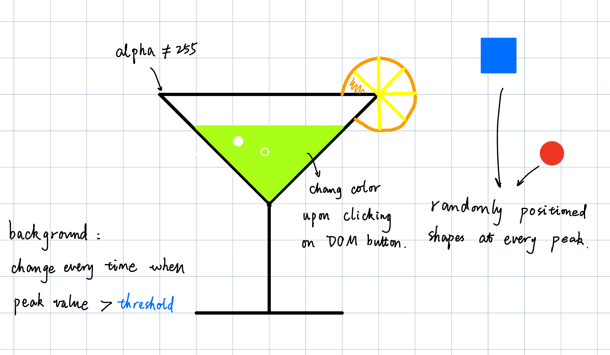
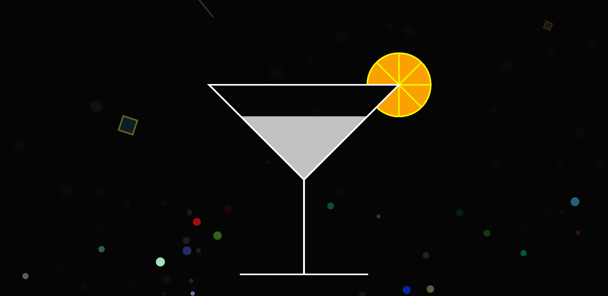
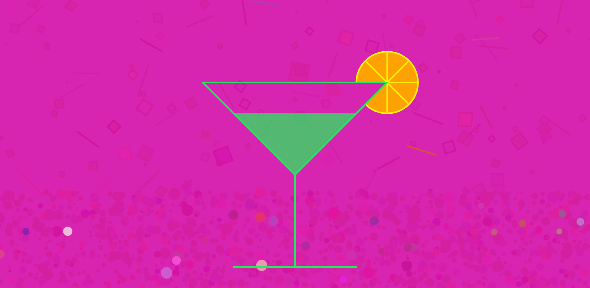
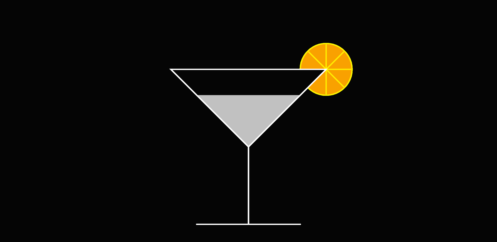
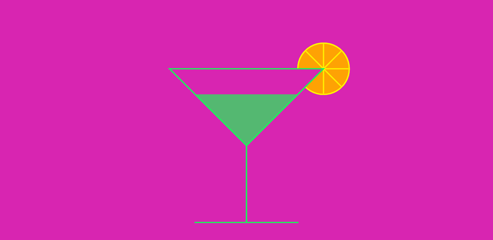
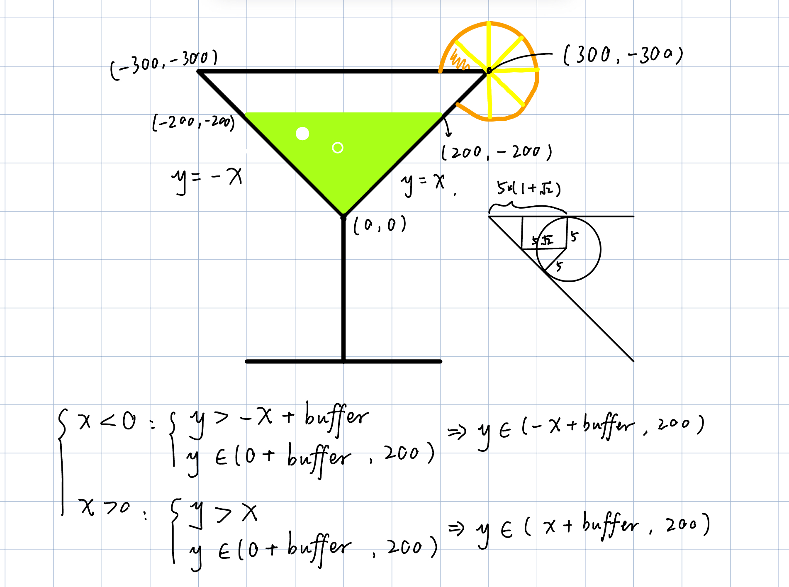

# HW08A: Neon Mondrian

In the Neon Mondrian project, I modified a Piet Mondrian painting by manipulating pixels. I changed the yellow and blue into two other different colors, replaced the largest red square with a GIF image, and adjusted the black in the image by controlling the lower slider in the upper left corner of the canvas. The slider above controls the similarity value, which controls the color detection in the image. 

## How I detect the colors
Initially, I detected the colors by comparing each pixel's color with Mondrian Red, Blue, Yellow, and Black. First, I used the Paint software in Windows to extract the four colors, and save them as four global variables. Then, for each image pixels, I compare its R, G, and B values with those of each Mondrian's color. For example, if the differences in R, G, and B values of a pixel and Mondrian Red are all below a value, then a Mondrian color is detected. Below is the effect of similarity value = 50. 

However, later I found that the sequence of color detection in code also matters if I adopt this color detection method. 

<table>
  <tr>
    <td></td>
    <td></td>
  </tr>
  <tr>
    <td>Detect Mondrian Red first, then Mondrian Yellow</td>
    <td>Detect Mondrian Yellow first, then Mondrian Red</td>
  </tr>
</table>

After analyzing, I think this is because the RGB values of red and yellow are closer than any other two colors. As the similarity value goes high, red and yellow are the first to be categorized into one color. 

Therefore, I started to change the way of color detection. I searched the keyword "color similarity" online and found [this](https://www.baeldung.com/cs/compute-similarity-of-colours) link very useful. The webpage introduces three approaches, and I used the Improved Approach: 

I didn't use the Best Approach because it is too complex for a simple project like mine. I learned the RGB to CIELAB conversion before and I believe it involves matrix computation. Despite being not perfect, the Improved Approach is sufficient to detect Mondrian Red, Blue, Yellow, and Black. All I need to do is to figure out a good threshold value (similarity value). After trying with the slider that controls the similarity value, I found that 28 is a good value to go. 

## "Replace" red square with an image
Before consultation, I thought replacing a color block with an image was very difficult. This is because a color block looks like an integrity on canvas, but it is actually separated in the list of pixels stored in the computer. It is too tedious to resize the image and replace pixels line by line, let alone the noise in the Mondrian image due to imperfect color detection. 

After consulting Thiago, I learned that it can be done in a very simple way: turn all the red pixels' alpha values into 0, and place the image I want right below the Mondrian image. The visual effect achieved is just like the red square is replaced with my image. 

## Unexpect finding: load image in low resolution
When setting the initial similarity value to 28, I once miswrote the GIF image width to 28. The GIF file was loaded with a width of 28 px but then stretched to fit the red square size. The resulting image is a low-res version of the GIF image, which is interesting to me because I like pixel art. This effect may be useful for my later creative coding project so I record it down here. 

## What happens if I run my sketch on images of different Mondrian paintings?
If I run my sketch on images of different Mondrian paintings, it will still detect Mondrian Red, Yellow, Blue, and Black well. In fact, by adjusting the similarity value in my code, it can detect even more colors other than these four. However, I may need to reconsider where to put my GIF image. I may also need to redefine the RGB values of Mondrian colors because they appear differently in different photographs. 

# HW08B: Visualizing Sound

In the Visualizing Sound project, I chose the song "Hopes And Dreams" from the VA-11 HALL-A - Complete Sound Collection. This album was created for one of my favorite video games called "[VA-11 Hall-A: Cyberpunk Bartender Action](https://store.steampowered.com/app/447530/VA11_HallA_Cyberpunk_Bartender_Action/)". In the game, the player assumes the role of a bartender named Jill at "VA-11 Hall-A", a small dive bar in a dystopian downtown city in the future world. The game adopts a pixelated style and cyberpunk aesthetic. 

Since one of Jill's tasks is to serve drinks to customers and chat with them, I decided to draw a cocktail glass on canvas. I also wanted the cocktail to create some bubbles and give the feeling of being at VA-11 Hall-A drinking and chatting. The colors of the cocktail glass, the background, and the bubble generation can be controlled by DOM buttons. 

The visualization of music is in the form of elements generated at random places in different shapes based on the sample value at the current time. 

To play or pause the song, press "p". To stop the song, press "s". 

Below is the screenshot of my sketch. 

## Music visualization
For music visualization, I first extracted the list of sample values of the song into the `samples` variable. Then, since the value of each sample is in the range of [-1,1], I categorized the samples based on their values. Initially, I set the three ranges to [-1, -0.5), [-0.5, 0.5], and (0.5, 1]. However, I tested this setting and realized that most samples are within the range of [-0.5, 0.5]. Therefore, I tested several other threshold value sets and settled with [-1, 0), [0, 0.2], (0.2, 1]. 

Samples in the range of [0, 0.2] will trigger a circle of random color at a random position on the lower one-third of the canvas. Since samples with values in [0, 0.2] frequently appear, the circles add a continuous dynamic to the canvas. For the samples with values > 0.2, they each will draw a line of random color at a random position on the upper two-thirds of the canvas. For the samples with values < 0, they each will draw a rectangle in a similar logic. The size of each circle, line, and square is related to their sample values. 

To create the fading effect, the background has its alpha value set to 20. 

## Change background color and cocktail glass color
This function is achieved by a DOM button named "change background". The background color is initially set to black but changes to a random color at every click on the "change background" button. The cocktail glass color and the cocktail color change accordingly and they are always complementary of the background color. This complementary color scheme provides a strong visual tension and looks very cyberpunk to me. The `changeBG` function helps achieve color randomization. 

## Bubble generation
Since I want the bubbles to stay in the cocktail glass, I need to randomly generate them in the range of a triangle. During the consultation, Thiago suggested that I can randomly generate bubbles in the range of a triangle, and draw two triangles right next to the cocktail triangle to act as "masks". However, since there are many elements continuously generated in the background, this masking approach will block some of them. 

Therefore, I tried to calculate the conditions to constrain the bubbles in the cocktail. The resulting logic seemed easy to implement by using an if-else statement. I added a `glassBuffer` to my logic so that the cocktail won't stick out of the glass. 

I decided to leave the control of bubble generation to the viewer. Therefore, I added a DOM button named "generate bubbles". Upon every click, ten bubbles will be generated in the range of the cocktail triangle. This is achieved by the `function generateBubbles()` and `function bubble()`. 
